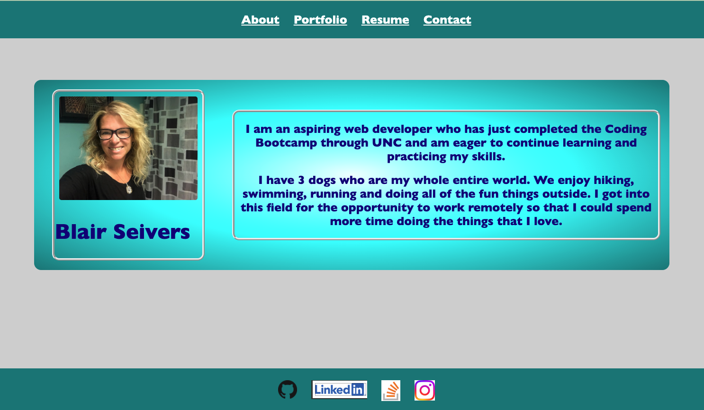
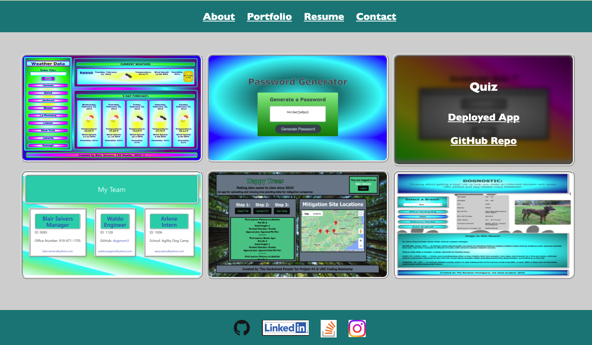
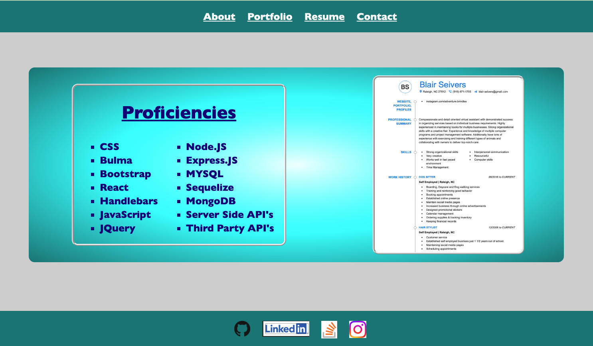
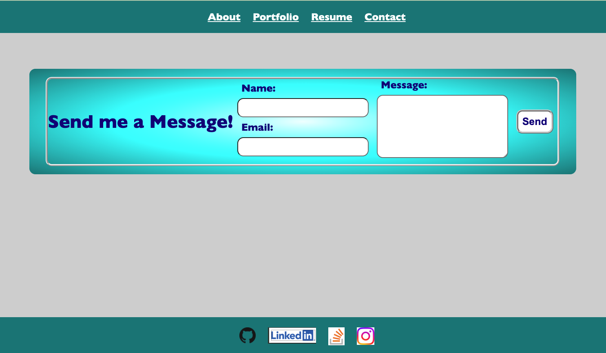

# 
BLAIR SEIVERS PORTFOLIO

## 
This website was created with React App to show off my skills, highlight samples of my work, and provide contact information.

 ## 
Table of Contents

  * [Usage](#usage)
  * [Contributing](#contributing)
  * [Deployment](#deployment)
  * [Screenshots](#screenshots)

  

  ## 
Usage

### 
Utilize the links in the navigation bar for more info about me:

**<u>ABOUT:</u>** Read a short bio. 
**<u>PORTFOLIO:</u>** View images of samples of my work. Hover over the images for relavant links on those projects. 
**<u>RESUME:</u>** See a list of aquired skills and an image of my resume. Hover over the image for a link to download the full resume file. 
**<u>CONTACT:</u>** Use this contact form to send me a message. I'd love to hear from you! 
**<u>FOOTER:</u>** Click the image links to check me out on various social media platforms.

  

  ## 
Contributing

  
My name is Blair Seivers and I can be reached for any questions on this project by email at
  blair.seivers@gmail.com  

  
You can view my other projects on GitHub here: https://github.com/dogmom3

  
  

  ## 
Deployment

  
 https://dogmom3.github.io/20-react-portfolio-blair/ 

  
  

  ## 
Screenshots

  <!-- ![About] -->

  

    
  
  

  <!-- 
  
  
   -->

 